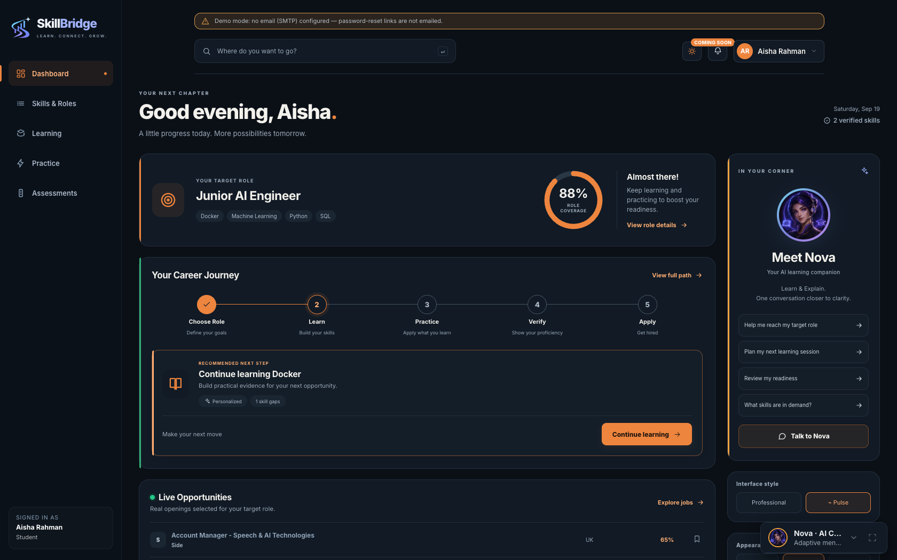
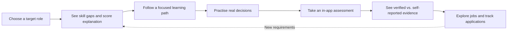
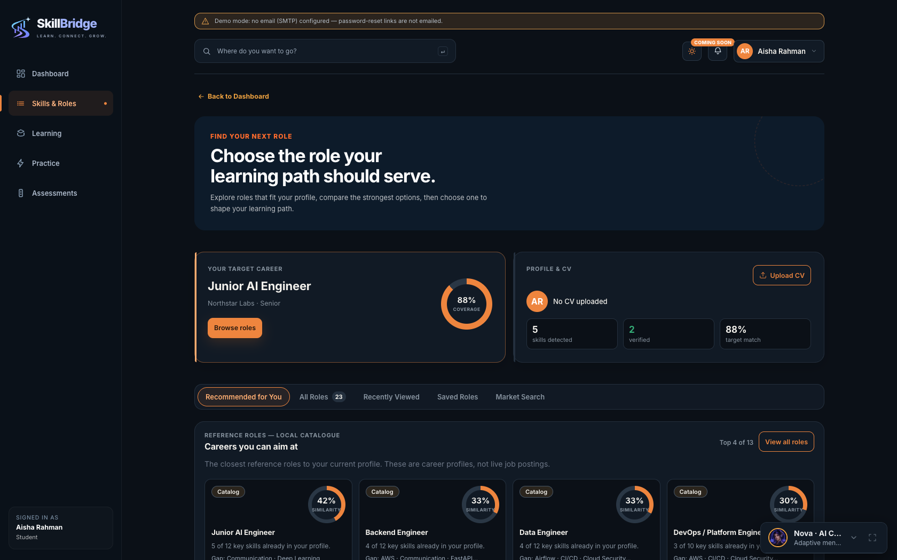
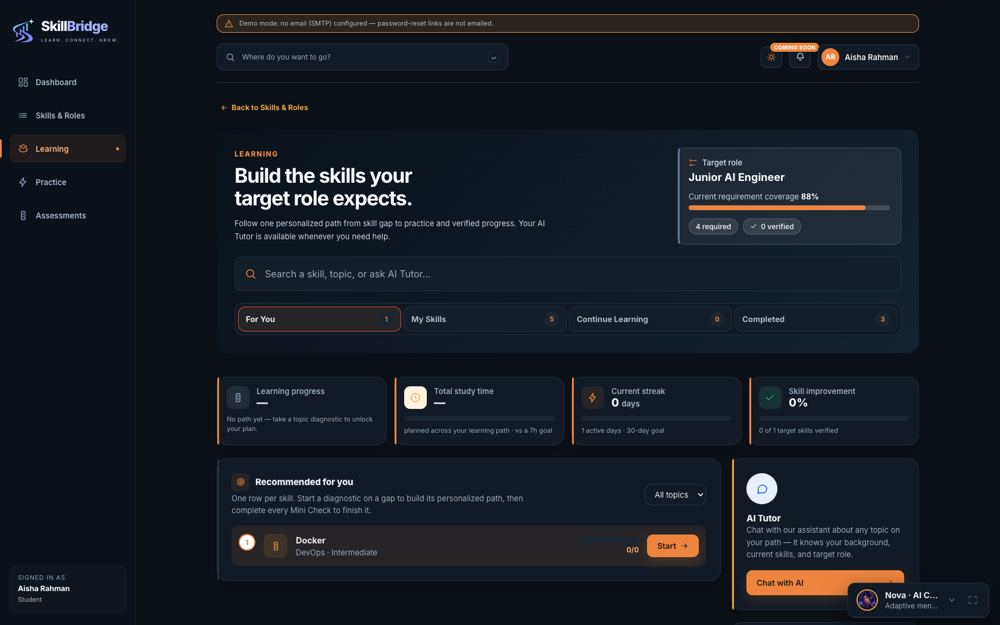
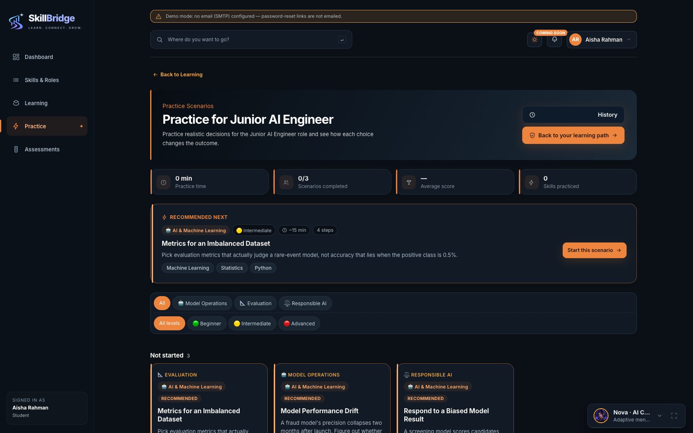
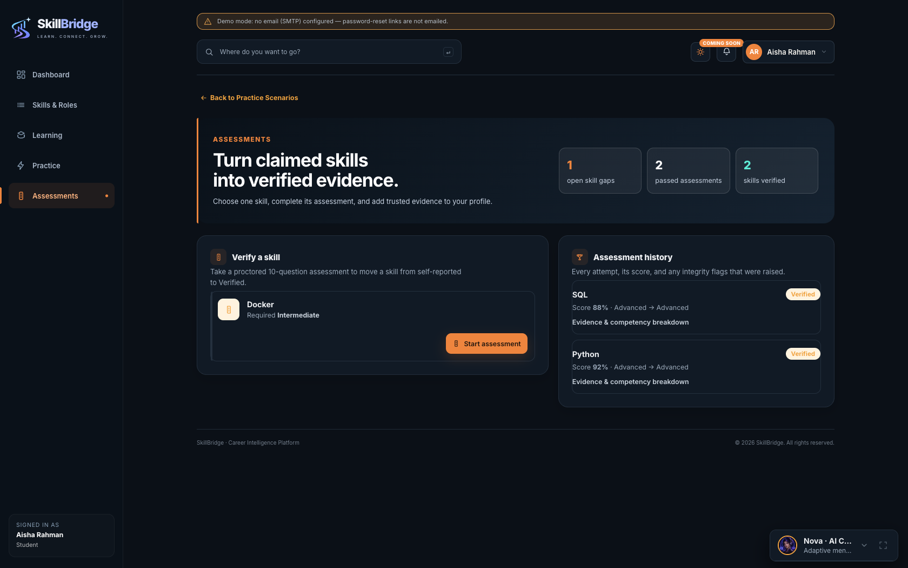
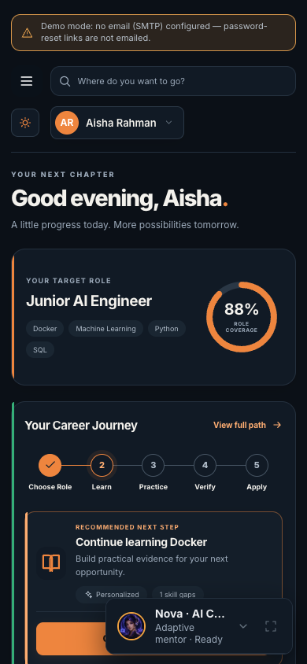
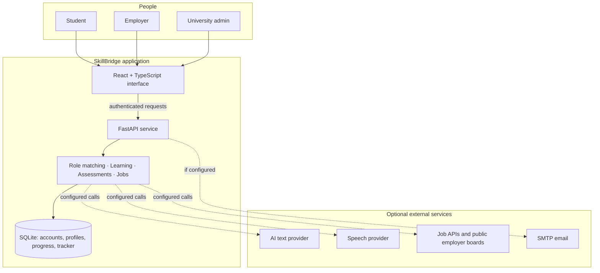

<div align="center">
  

# SkillBridge

**Choose a direction. Build the skills. Show the evidence.**

An AI-assisted career-readiness prototype connecting students, employers, and
universities through one practical learning-to-opportunity journey.

[Explore the experience](#the-experience) · [See how it works](#how-it-works) · [Run locally](#run-it-locally) · [Demo walkthrough](#five-minute-demo)
</div>

<p align="center">
  
</p>

> **Project status:** educational prototype. SkillBridge demonstrates career
> exploration, learning, in-app assessment, and job discovery. It is not a
> professional credential issuer, hiring guarantee, or production proctoring
> service.

## The problem we solve

Students often have courses, a CV, and job listings—but no clear way to connect
them. SkillBridge turns a target role into an understandable skill gap, a next
learning step, evidence from practice and assessments, and relevant opportunities.
Each part leads to the next instead of becoming another disconnected dashboard.

| For students | For employers | For universities |
|---|---|---|
| Discover roles, learn toward a goal, practise, and track applications | Define role requirements and inspect candidate matches | View anonymized cohort skill-gap trends |

## The experience



- **Career direction:** search and compare roles, inspect required skills and
  provenance, then choose a target. Match-score breakdowns explain the number
  shown on screen.
- **Focused learning:** a personalized plan highlights the next step. Lessons,
  resources, practice, and mini-checks are presented in manageable stages.
- **Evidence, not just claims:** CV-derived skills remain *self-reported*.
  In-app assessments can mark a skill *verified within SkillBridge*; practice
  alone cannot do that.
- **AI mentors:** Nova, Axel, Sage, and Vex support conversation and interview
  practice. Text can work with a configured AI provider or a labelled local
  fallback; live speech requires working browser/provider support and quota.
- **Opportunities:** the job feed combines supported external providers and
  selected public employer boards. Listings show their source and status; users
  can save a listing and privately track application stages.
- **Two looks, one product:** Professional and Casual Pulse presentation modes
  include light, dark, and system appearance. The responsive UI includes
  English/Arabic mentor behavior and RTL support where implemented.

<details>
<summary><strong>Open the product gallery</strong></summary>

| Find a role | Learn toward it |
|---|---|
|  |  |
| Practise decisions | Review assessments |
|  |  |



</details>

## How it works



The backend owns authorization, score calculations, assessment results, and
private application records. The frontend displays those results; it does not
award verified skills merely because a student completed a lesson or scenario.
External providers are optional and may be unavailable or rate-limited.

Technical reviewers can follow the request flow and evidence boundaries in
[`docs/architecture.md`](docs/architecture.md).

## Run it locally

Requires **Node.js 18+** and **Python 3.10+** on macOS, Windows, or Linux.
From a fresh clone:

```bash
git clone https://github.com/aboodko1/SkillBridge-upgrade.git
cd SkillBridge-upgrade
npm start
```

The first run sets up dependencies, builds the frontend, seeds a local SQLite
demo database, and prints the URL (normally <http://localhost:8000>; another
port is selected if it is occupied). No paid API is needed to explore the local
demo. Optional AI, voice, jobs, Google sign-in, and email services are configured
through a **local, ignored** `.env` based on [`.env.example`](.env.example).
Never commit real keys or databases.

| Command | Purpose |
|---|---|
| `npm start` | Build and run the local app |
| `npm start -- --dev` | Run with frontend live reload |
| `npm start -- --no-build` | Reuse an existing frontend build |
| `npm start -- --port 9000` | Choose a port |

**Data warning:** `npm start -- --reset` deletes the local demo database before
reseeding it. Back up any data you need first.

## Five-minute demo

Seeded demo accounts use the password `demo1234`. These are **local demo-only
credentials**; never use them for a public deployment.

| View | Email |
|---|---|
| Student | `aisha@student.edu` |
| Employer | `hr@northstar.com` |
| University admin | `admin@univ.edu` |

1. **Student:** sign in, explore a target role, and open **How is this score
   built?** to see the skills behind its match percentage.
2. **Learning:** follow the highlighted next step, then try a practice scenario
   and review why each decision mattered.
3. **Assessment:** inspect the rules and attempt a skill check. The final
   assessment uses a camera permission gate and local integrity signals; it is
   an in-app check, not biometric identity verification. If camera permission
   is unavailable, show the guided learning and practice flow instead.
4. **Jobs:** view a sourced listing, or explain the provider/cached/empty state
   honestly, then save a listing to the private application tracker.
5. **Other views:** sign in as Employer to see role requirements and candidate
   matching, then University admin for anonymized cohort trends.

For technical detail and demo resources, see the [documentation index](docs/README.md).

## Trust and current limits

- **In-app verification is not an external credential.** Assessment scores and
  camera/browser signals are heuristics, not proof of identity or an anti-cheat
  guarantee. Camera analysis is local during an attempt; the app states that
  video is not recorded or stored.
- **Job coverage is partial.** Bright Data requires an API key *and* an active
  SERP zone; other providers and public employer boards have their own coverage
  and availability. SkillBridge does not claim to scrape LinkedIn or Wuzzuf, or
  list every opening in Egypt. The original posting is the source of truth.
- **AI and voice depend on configuration.** Deterministic fallbacks keep the
  prototype explorable, but should not be presented as live model output.
- **Localization is in progress.** English/Arabic mentor experiences and RTL
  support exist, but not every screen is fully translated. There is no native
  mobile app, payment system, or calendar integration.

See [`docs/job-providers.md`](docs/job-providers.md) for provider behavior and
[`SECURITY.md`](SECURITY.md) for security reporting.

## Build and verify

```bash
npm run test:frontend   # TypeScript check
npm run build           # frontend production build
npm run test:backend    # complete backend pytest suite
```

These checks need no production keys. The repository also includes focused
frontend contract checkers and browser-regression scripts. A passing build is
not a substitute for checking real user flows, responsive layouts, light/dark
appearance, keyboard use, and Arabic/RTL in a browser.

## Team

**Khaled Mohamed · Abdelrahman Mohamed · Eslam Osama**

SkillBridge is a collaborative educational project. The source is the current
implementation; the diagrams, setup notes, and screenshots in
[`docs/`](docs/README.md) explain the current prototype.
