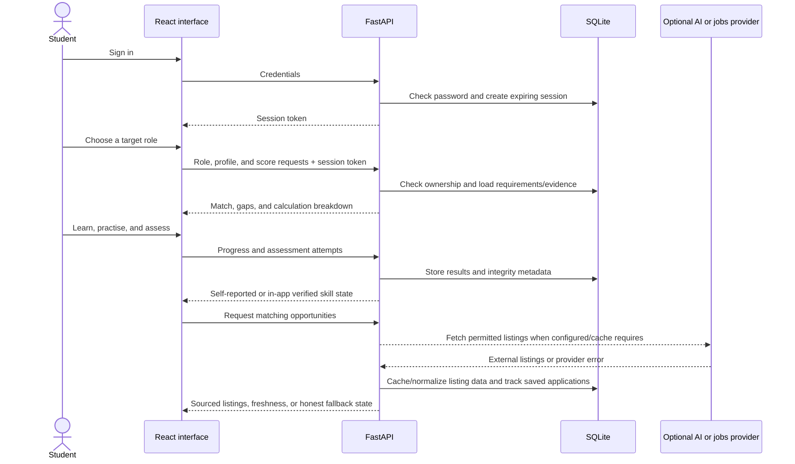
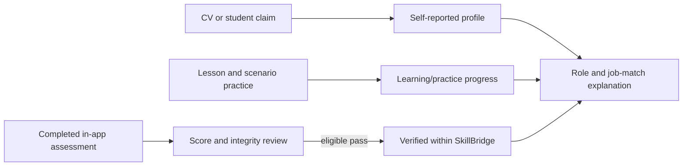

# SkillBridge architecture and evidence boundaries

This page is for technical reviewers. The [main README](../README.md) is the
short product story; the code and tests are the implementation authority.

## Request and data flow

## Three different kinds of evidence

These states are deliberately different. A CV or a completed scenario cannot
award a verified skill. “Verified” means only that the app's own assessment
conditions were met; it is not a third-party credential. Browser and camera
integrity signals are fallible heuristics, not biometric identity proof.

## External-provider boundary

| External capability | Local behavior when unavailable | What the UI should say |
|---|---|---|
| AI text provider | Deterministic fallback where supported | Do not label fallback as live AI |
| ElevenLabs speech | Text can remain available; audio may fail | Voice unavailable or quota exhausted |
| Job providers | Other configured providers, cached results, or empty state | Show source, freshness, and provider status |
| SMTP | Local demo verification behavior | Do not claim an email was delivered |

Credentials remain server-side in a local `.env`, never in frontend source or
the public repository. The job feed is a subset of what its providers return;
external listing pages remain authoritative for application details.

## Review map

| Concern | Main code |
|---|---|
| API and authorization | `backend/app/main.py`, `backend/app/auth.py` |
| Database and migrations | `backend/app/database.py`, `backend/app/models.py` |
| Role/job match calculations | `backend/app/matching.py`, `backend/app/match_explain.py` |
| Assessment integrity | `backend/app/integrity.py`, `frontend/src/lib/webcamIntegrity.ts` |
| Jobs providers and caching | `backend/app/jobs.py` |
| AI and speech | `backend/app/genai.py`, `backend/app/tts.py` |
| Student interface | `frontend/src/pages/`, `frontend/src/components/` |

Run the commands in the main README before reviewing. Tests and local smoke
checks are useful evidence, but live provider availability depends on valid
configuration and quota at the time of the demo.
